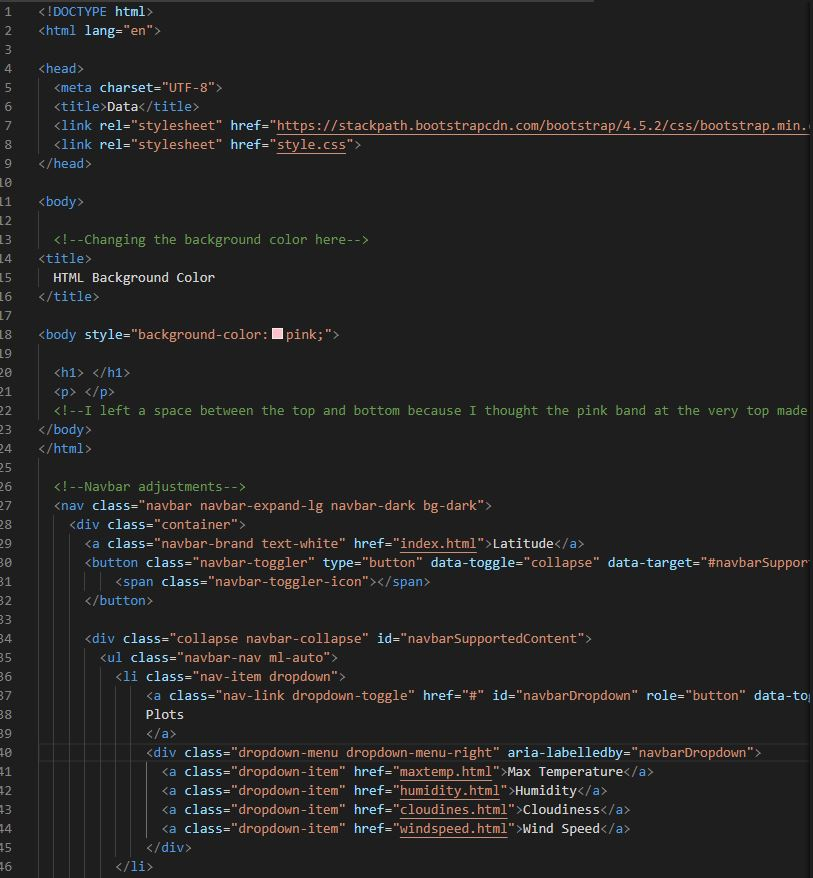
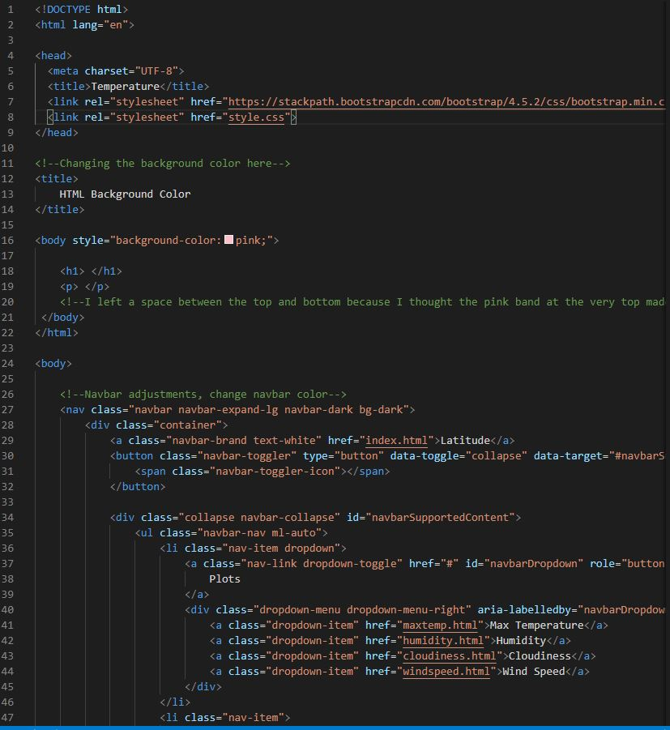
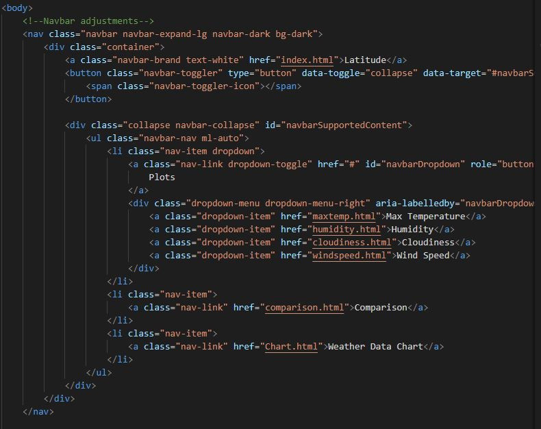
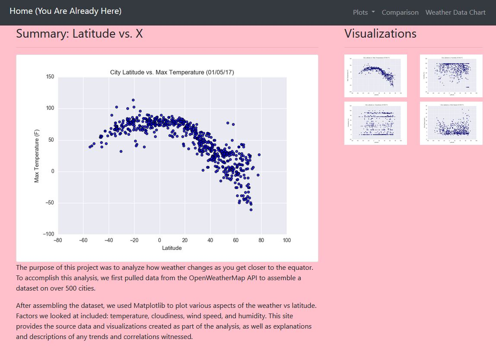
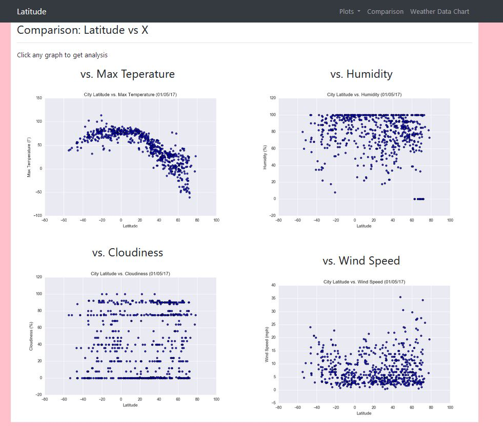
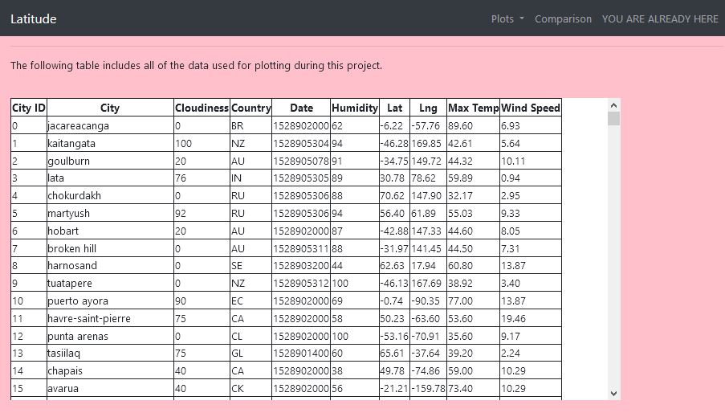

# Web Design Visualization Dashboard

## Project Purpose
Create a visualization dashboard website plotting weather data that was previously collected with Python and the OpenWeather API to assemble a dataset on over 500 cities.  In building the dashboard individual pages for each plot will be created which we can navigate between and show how the weather changes depending on the latitude.  These pages will contain the visualizations and their corresponding explanations.

## Process
Our website will consist of 7 pages total, including:
- A landing page which will have an explanation of the project 
    
    - Landing Page Code Snippet 

- Four visualization pages, each with a descriptive title and heading tage
    - Code snippet from one of the visualization page 

- A Comparions page which will contain all visualizations on the same page
    - Code snippet from comparison page 

- A Data Page which will display a responsive table containing the data used in the visualizations

Utilizing JavaScript, Bootstrap, HTML and CSS the above web pages will be created in VS Code and deployed via GitHub

## Results and Conclusions (Condensed)
### Screenshots of Deployed Website

#### Landing Page

#### Comparison Page

#### Responsive Data Table

